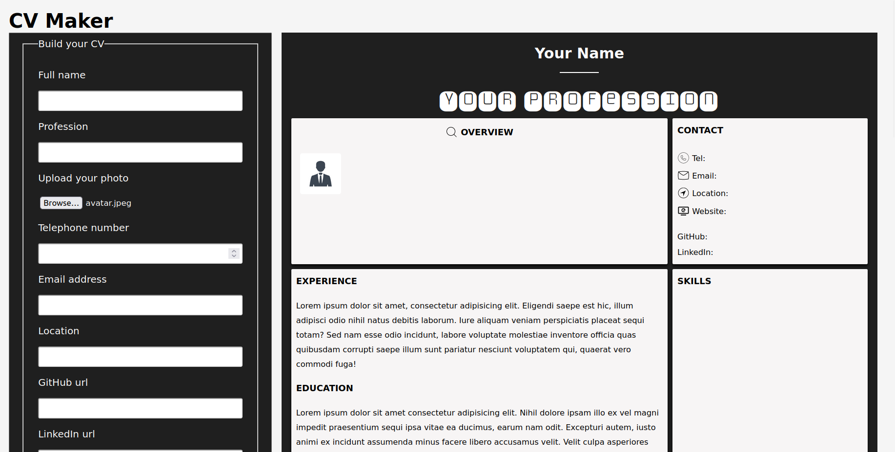

# CV Maker

- Create a CV with a ready made template and print it out or save it as PDF.

- To add a photo to the CV, copy the photo to the root folder (CVMAKER) and then click the Browse botton to display it in the CV.

### Screenshot

Live url: [CV Maker](https://stacknatic.github.io/cv_maker/)